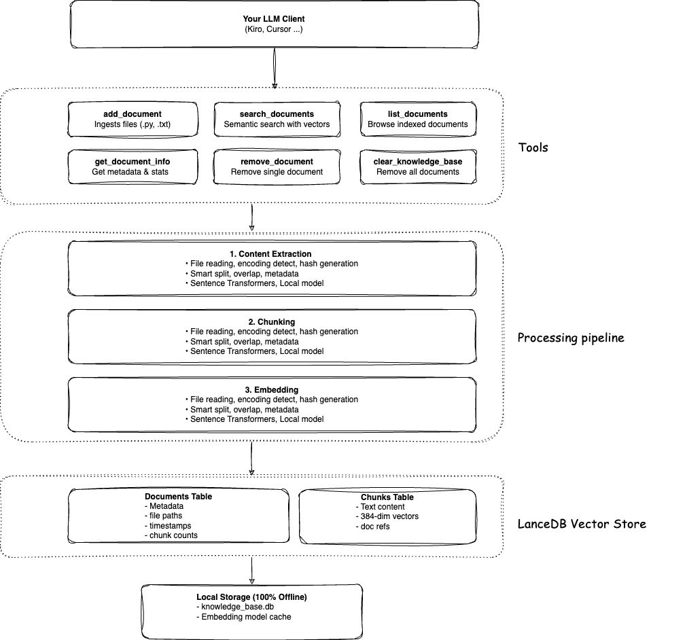

# Context Lens

**Give your AI the ability to understand meaning, not just match keywords.**

[](https://github.com/cornelcroi/codelens/actions)
[](https://badge.fury.io/py/context-lens)
[](https://www.python.org/downloads/)
[](https://opensource.org/licenses/MIT)

## What is Context Lens?

Context Lens is a self-contained Model Context Protocol (MCP) server with built-in serverless vector storage (LanceDB) that brings semantic search to your AI assistant. Point it at any content - codebases, documentation, contracts, legal documents, research papers, or any text files - and your AI can instantly understand and answer questions about the content.

**Traditional keyword search** finds files containing specific words. Miss the exact term? Miss the content.

**Context Lens** understands meaning. Ask about "authentication" and find code about login, credentials, tokens, OAuth, and access control - even if those files never use the word "authentication." Ask about "liability clauses" in contracts and find sections about indemnification, warranties, and limitations of liability.

## Why LanceDB?

Context Lens uses **LanceDB** as its vector database - a modern, serverless solution that makes semantic search accessible to everyone:

**🆓 Completely Free & Local**
- No cloud services, no API keys, no subscriptions
- No servers to run or manage
- All data stays on your machine - 100% private

**⚡ Zero Infrastructure**
- Embedded database - just a file on disk
- No installation, no configuration, no setup
- Works like SQLite but for vectors

**🚀 Fast & Efficient**
- Built on Apache Arrow for columnar storage
- Optimized for vector similarity search
- Handles millions of embeddings efficiently

**💾 Simple Storage**
- Single file database (`knowledge_base.db`)
- Easy to backup, move, or delete
- No complex database management

Think of it as "SQLite for AI embeddings" - all the power of vector search without the complexity of traditional vector databases.

## Features

### Core Capabilities

- 🔍 **Semantic Search** - Understand meaning, not just keywords - find related concepts even without exact matches
- 🚀 **Zero Setup** - No installation, no configuration, no API keys - just add to your MCP config and go
- 💾 **Serverless Vector Storage** - Built-in LanceDB means no external database to manage
- 🔒 **100% Local & Private** - All data, embeddings, and processing stay on your machine

### Content Sources

- � ***Local Files & Folders** - Index your entire project or specific directories
- � **GitHub Integration** - Add public repos, specific branches, directories, or single files
- �  **20+ File Types** - Python, JavaScript, TypeScript, Java, Go, Rust, Markdown, and more

### Perfect For

**Software Development:**
- � ***Code discovery** - "How does this project handle database connections?"
- � **Lebarning** - Add React's source code and ask "How do hooks work internally?"
- � **Debougging** - "Find similar error handling patterns in this codebase"
- 👥 **Onboarding** - Help new team members understand your architecture
- ♻️ **Refactoring** - "Where else do we use this deprecated pattern?"

**Document Analysis:**
- 📄 **Legal & Contracts** - "Find all liability clauses in these contracts"
- 🏥 **Insurance Documents** - "What are the coverage exclusions across all policies?"
- 📊 **Research Papers** - "Find studies about machine learning in healthcare"
- 📚 **Technical Documentation** - "How do I configure SSL in this system?"
- 📝 **Business Documents** - "Find all references to pricing terms"

## Setup with Your LLM

No installation needed! Just configure your AI assistant to use Context Lens:

### 📘 Claude Desktop

**Config file location:**
- macOS: `~/Library/Application Support/Claude/claude_desktop_config.json`
- Windows: `%APPDATA%/Claude/claude_desktop_config.json`

```json
{
  "mcpServers": {
    "context-lens": {
      "command": "uvx",
      "args": ["context-lens"]
    }
  }
}
```

**Alternative using CLI:**
```bash
claude mcp add context-lens -- npx context-lens@latest
```

Restart Claude Desktop and you're ready!

---

### 🎯 Cursor

**Config file:** `.cursor/mcp.json` in your workspace

```json
{
  "mcpServers": {
    "context-lens": {
      "command": "uvx",
      "args": ["context-lens"]
    }
  }
}
```

Open **Settings → MCP Servers** to confirm the connection and view available tools.

---

### ⚡ Kiro IDE

**Config file:** `.kiro/settings/mcp.json` in your workspace

```json
{
  "mcpServers": {
    "context-lens": {
      "command": "uvx",
      "args": ["context-lens"],
      "disabled": false,
      "autoApprove": ["list_documents", "search_documents"]
    }
  }
}
```

**Reload:** Command Palette → "MCP: Reload Servers"

The `autoApprove` setting allows read-only operations without confirmation prompts.

---

### 🔄 Continue.dev

**Config file:** `~/.continue/config.json`

```json
{
  "mcpServers": [
    {
      "name": "context-lens",
      "command": "uvx",
      "args": ["context-lens"]
    }
  ]
}
```

Restart Continue.dev to apply changes.

---

### 🤖 OpenAI Codex

```bash
codex mcp add context-lens -- npx @context-lens@latest
```

---

### 🔧 Advanced: Node.js Direct

For custom setups or local development:

```json
{
  "mcpServers": {
    "context-lens": {
      "command": "node",
      "args": ["/absolute/path/to/context-lens/dist/index.js"]
    }
  }
}
```

---

### 🌐 Other MCP Clients

For any MCP-compatible client, use the standard configuration:

```json
{
  "command": "uvx",
  "args": ["context-lens"]
}
```

---

### Custom Database Location (Optional)

```json
{
  "mcpServers": {
    "context-lens": {
      "command": "uvx",
      "args": ["context-lens", "--db-path", "./my_knowledge_base.db"]
    }
  }
}
```

Or using environment variables:
```json
{
  "mcpServers": {
    "context-lens": {
      "command": "uvx",
      "args": ["context-lens"],
      "env": {
        "LANCE_DB_PATH": "./my_knowledge_base.db"
      }
    }
  }
}
```

> **💡 For all configuration options**, see [Advanced Configuration](#advanced-configuration) section below.

## What You Can Add

Context Lens works with any text-based content:

**Code & Development:**
- **� Sinagle files**: `./README.md`, `/path/to/script.py`
- **�  Local folders**: `./src/`, `/path/to/project/`
- **💻 Local repositories**: `./my-project/`, `/Users/you/code/app/`
- **🌐 GitHub URLs**: 
  - Repositories: `https://github.com/user/repo`
  - Specific files: `https://github.com/user/repo/blob/main/file.py`
  - Directories: `https://github.com/user/repo/tree/main/src`

**Documents & Content:**
- **📄 Legal Documents**: Contracts, agreements, terms of service
- **🏥 Insurance Policies**: Coverage documents, policy terms, claims procedures
- **📊 Research Papers**: Academic papers, technical reports, whitepapers
- **📚 Documentation**: Technical docs, user manuals, API documentation
- **📝 Business Documents**: Proposals, reports, meeting notes, wikis
- **📋 Text Files**: Any `.txt`, `.md`, `.pdf` (text-based), or plain text content

## Architecture




## Manual Installation (Optional)

Most users don't need to install anything - just configure your LLM client as shown above and `uvx` will handle everything automatically.

If you prefer to install locally:

```bash
pip install context-lens
```

Or install from source:

```bash
git clone https://github.com/cornelcroi/context-lens.git
cd context-lens
pip install -e .
```

## What You Can Add

### 📁 Local Files & Directories
- **Single file**: `/path/to/script.py`
- **Directory**: `/path/to/project/src/`
- **Recursive**: Automatically processes subdirectories

### �L GitHub Repositories (Public)
- **Entire repo**: `https://github.com/user/repo`
- **Specific branch**: `https://github.com/user/repo/tree/develop`
- **Subdirectory**: `https://github.com/user/repo/tree/main/src`
- **Single file**: `https://github.com/user/repo/blob/main/file.py`

### �E Supported File Types (20+ formats)
- **Python**: `.py`
- **JavaScript/TypeScript**: `.js`, `.jsx`, `.ts`, `.tsx`
- **Web**: `.md`, `.txt`, `.json`, `.yaml`, `.yml`
- **Systems**: `.java`, `.cpp`, `.c`, `.h`, `.go`, `.rs`
- **Scripts**: `.sh`, `.bash`, `.rb`, `.php`

### 🚫 Automatically Ignored
- **Dependencies**: `node_modules`, `venv`, `vendor`
- **Build outputs**: `dist`, `build`, `target`, `out`
- **Caches**: `__pycache__`, `.cache`, `.pytest_cache`
- **Version control**: `.git`, `.svn`, `.hg`
- **IDE files**: `.idea`, `.vscode`, `.vs`
- **Large files**: Files over 10MB

### 💡 Try These Popular Repositories

**Web Frameworks:**
```
https://github.com/django/django          # Django web framework
https://github.com/pallets/flask          # Flask microframework  
https://github.com/fastapi/fastapi        # FastAPI modern framework
```

**Data Science:**
```
https://github.com/pandas-dev/pandas      # Pandas data analysis
https://github.com/scikit-learn/scikit-learn  # Machine learning
https://github.com/pytorch/pytorch        # PyTorch deep learning
```

**Utilities:**
```
https://github.com/psf/requests           # HTTP library
https://github.com/python/cpython         # Python itself!
https://github.com/pallets/click          # CLI framework
```

**Learn Specific Features:**
```
https://github.com/django/django/tree/main/django/contrib/auth  # Django auth
https://github.com/fastapi/fastapi/tree/master/fastapi          # FastAPI core
https://github.com/requests/requests/tree/main/requests         # Requests lib
```

## Available Tools

Once connected to your LLM, you get six powerful tools:

### 📥 add_document(file_path_or_url)
Add documents to the knowledge base
- Local files: `"/path/to/file.py"`
- GitHub repos: `"https://github.com/user/repo"`
- GitHub files: `"https://github.com/user/repo/blob/main/..."`
- Smart: Skips if already indexed with same content
- Extracts content, creates embeddings, stores in LanceDB

### 🔍 search_documents(query, limit=10)
Semantic search across all documents
- Finds relevant code/text by meaning, not just keywords

### 📋 list_documents(limit=100, offset=0)
List all indexed documents with pagination
- Browse what's in your knowledge base

### ℹ️ get_document_info(file_path)
Get metadata about a specific document
- Check if indexed, when added, content hash, chunk count

### 🗑️ remove_document(file_path)
Remove a specific document from the knowledge base
- Clean up outdated or unwanted files

### 🧹 clear_knowledge_base()
Remove all documents and start fresh
- Complete reset when needed

### Example Conversations

**Adding a GitHub Repository:**
```
You: Add the FastAPI repository to my knowledge base

LLM: I'll add the FastAPI repository for you.
     [Calls add_document("https://github.com/tiangolo/fastapi")]
     
     Cloning repository...
     Processing 247 Python files...
     ✓ Added 247 files from repository with 1,543 chunks
     
     You can now ask questions about FastAPI's implementation!

You: How does FastAPI handle dependency injection?

LLM: [Searches the FastAPI codebase...]
     Based on the FastAPI source code, dependency injection works through...
```

**Adding Local Files:**
```
You: Add all Python files in my src/ directory to the knowledge base

LLM: I'll add those files for you.
     [Calls add_document for each .py file]
     ✓ Added 15 Python files to the knowledge base

You: How does this codebase handle authentication?

LLM: Let me search for authentication-related code.
     [Calls search_documents with query "authentication handling"]
     
     Based on the code, you use JWT tokens with OAuth2. Here's what I found:
     - src/auth/jwt.py: Token generation and validation
     - src/auth/oauth.py: OAuth2 flow implementation
     - src/middleware/auth.py: Authentication middleware
     
     The main authentication flow is...
```

## Quick Start Examples

### Example 1: Add Your Project
```
You: Add all Python files from /Users/me/my-project/src to the knowledge base

LLM: [Processes all .py files in the directory]
     ✓ Added 23 Python files with 156 chunks
```

### Example 2: Learn from Open Source
```
You: Add the FastAPI repository so I can learn how it works

LLM: [Calls add_document("https://github.com/tiangolo/fastapi")]
     Cloning repository...
     ✓ Added 247 files from repository with 1,543 chunks
     
You: How does FastAPI handle dependency injection?

LLM: [Searches and explains based on actual FastAPI source code]
```

### Example 3: Research a Specific Feature
```
You: Add just the authentication module from Django

LLM: [Calls add_document("https://github.com/django/django/tree/main/django/contrib/auth")]
     ✓ Added 45 files from django/contrib/auth with 312 chunks

You: Show me how Django implements password hashing

LLM: [Provides detailed explanation with code references]
```

## Example Queries

Once you've added documents, here are powerful queries you can ask:

### � UCode Understanding
```
"How does this codebase handle database connections?"
"Explain the authentication flow in this project"
"What design patterns are used in this repository?"
"How is error handling implemented?"
"Show me how the API endpoints are structured"
```

### � Docuument Analysis
```
"Find all liability clauses in these contracts"
"What are the termination conditions across all agreements?"
"Summarize the coverage exclusions in these insurance policies"
"Find all references to payment terms and pricing"
"What are the data privacy requirements mentioned in these documents?"
```

### � Debuggin g & Problem Solving
```
"Find examples of how to handle file uploads"
"Where is the rate limiting logic implemented?"
"Show me similar error handling patterns"
"How do other files handle this exception?"
"Find all places where the code validates user input"
```

### 📚 Learning & Research
```
"How does FastAPI implement dependency injection?"
"Compare how Django and Flask handle routing"
"What's the difference between these two implementations?"
"Show me examples of async/await usage in this codebase"
"How does this library handle backwards compatibility?"
```

### � Buesiness & Legal Documents
```
"Find all force majeure clauses in these contracts"
"What are the warranty terms across all vendor agreements?"
"Summarize the compliance requirements in these policies"
"Find references to intellectual property rights"
"What are the renewal terms in these service agreements?"
```

### ♻️ Refactoring & Code Review
```
"Find all files that use the old authentication method"
"Where else is this deprecated function used?"
"Show me similar code that might have the same bug"
"Find duplicate logic that could be refactored"
"What files would be affected if I change this interface?"
```

### 🌟 Open Source Exploration
```
"How does React implement hooks internally?"
"Show me how Django's ORM builds SQL queries"
"How does FastAPI achieve such high performance?"
"Explain how pytest's fixture system works"
"How does requests handle HTTP retries?"
```

### 💡 Tips for Better Queries

**✅ Good Queries:**
- Be specific: "How does FastAPI validate request bodies?" or "Find indemnification clauses"
- Ask about concepts: "Explain the middleware pattern" or "What are the liability terms?"
- Request examples: "Show me async database queries" or "Find payment terms examples"
- Compare: "How is this different from the old implementation?" or "Compare warranty terms"

**❌ Avoid:**
- Too vague: "Tell me about the code" or "Tell me about the documents"
- Too broad: "Explain everything"
- Outside scope: Questions about content not in the knowledge base

### 📋 Document Analysis Use Cases

**Legal & Contracts:**
- Review multiple contracts to find specific clauses
- Compare terms across different agreements
- Identify potential risks or missing provisions
- Extract key dates, parties, and obligations

**Insurance & Healthcare:**
- Understand coverage terms and exclusions
- Find claim procedures and requirements
- Compare policies from different providers
- Identify gaps in coverage

**Research & Academia:**
- Find relevant studies on specific topics
- Compare methodologies across papers
- Extract key findings and conclusions
- Identify research gaps

**Business Operations:**
- Search through meeting notes and decisions
- Find project requirements and specifications
- Review proposals and RFPs
- Analyze reports and documentation

## Advanced Configuration

### CLI Parameters

Context Lens supports CLI parameters for customization. Here are all available options:

**Basic Usage:**
```json
{
  "mcpServers": {
    "context-lens": {
      "command": "uvx",
      "args": ["context-lens"]
    }
  }
}
```

**All CLI Parameters:**
```json
{
  "mcpServers": {
    "context-lens": {
      "command": "uvx",
      "args": [
        "context-lens",
        "--config", "/path/to/config.yaml",
        "--db-path", "/path/to/knowledge_base.db",
        "--log-level", "DEBUG"
      ]
    }
  }
}
```

**Available CLI Options:**
- `--config PATH` - Path to YAML configuration file
- `--db-path PATH` - Path to LanceDB database (default: `./knowledge_base.db`)
- `--log-level LEVEL` - Logging level: `DEBUG`, `INFO`, `WARNING`, `ERROR`, `CRITICAL`
- `--show-config` - Display current configuration and exit
- `--version` - Show version information
- `--help` - Show help message

### Environment Variables

All configuration can be set via environment variables:

```json
{
  "mcpServers": {
    "context-lens": {
      "command": "uvx",
      "args": ["context-lens"],
      "env": {
        "LANCE_DB_PATH": "/path/to/knowledge_base.db",
        "LANCE_DB_TABLE_PREFIX": "kb_",
        "LOG_LEVEL": "DEBUG",
        "MCP_SERVER_NAME": "my-knowledge-base",
        "EMBEDDING_MODEL": "sentence-transformers/all-MiniLM-L6-v2",
        "EMBEDDING_BATCH_SIZE": "32",
        "EMBEDDING_CACHE_DIR": "./models",
        "MAX_FILE_SIZE_MB": "10",
        "CHUNK_SIZE": "1000",
        "CHUNK_OVERLAP": "200",
        "SUPPORTED_EXTENSIONS": ".py,.txt,.md,.js,.ts,.java,.cpp,.c,.h,.go,.rs,.sh,.bash,.rb,.php,.json,.yaml,.yml,.jsx,.tsx"
      }
    }
  }
}
```

**Environment Variables Reference:**

| Variable | Default | Description |
|----------|---------|-------------|
| `LANCE_DB_PATH` | `./knowledge_base.db` | Path to LanceDB database |
| `LANCE_DB_TABLE_PREFIX` | `kb_` | Prefix for database tables |
| `LOG_LEVEL` | `INFO` | Logging level |
| `MCP_SERVER_NAME` | `knowledge-base` | Server name for identification |
| `EMBEDDING_MODEL` | `sentence-transformers/all-MiniLM-L6-v2` | Embedding model to use |
| `EMBEDDING_BATCH_SIZE` | `32` | Batch size for embedding processing |
| `EMBEDDING_CACHE_DIR` | `./models` | Directory to cache embedding models |
| `MAX_FILE_SIZE_MB` | `10` | Maximum file size to process (MB) |
| `CHUNK_SIZE` | `1000` | Text chunk size for processing |
| `CHUNK_OVERLAP` | `200` | Overlap between text chunks |
| `SUPPORTED_EXTENSIONS` | See [Supported File Types](#supported-file-types) | Comma-separated list of file extensions |

### Configuration File (YAML)

Create a `config.yaml` file for complex setups:

```yaml
database:
  path: "./knowledge_base.db"
  table_prefix: "kb_"

embedding:
  model: "sentence-transformers/all-MiniLM-L6-v2"
  batch_size: 32
  cache_dir: "./models"

processing:
  max_file_size_mb: 10
  chunk_size: 1000
  chunk_overlap: 200
  supported_extensions:
    - ".py"
    - ".txt"
    - ".md"
    - ".js"
    - ".ts"
    # See "Supported File Types" section for complete list

server:
  name: "knowledge-base"
  log_level: "INFO"
```

Then use it:
```json
{
  "mcpServers": {
    "context-lens": {
      "command": "uvx",
      "args": ["context-lens", "--config", "config.yaml"]
    }
  }
}
```

## How It Works

### The Magic Behind the Scenes

```
1. 📄 Document Ingestion
   ├─ Read file content with encoding detection
   ├─ Generate content hash for deduplication
   ├─ Extract metadata (size, timestamps, type)
   └─ Split into overlapping chunks (~1000 chars)

2. 🧮 Vector Embedding
   ├─ Load sentence-transformers model (all-MiniLM-L6-v2)
   ├─ Convert each chunk to 384-dimensional vector
   ├─ Batch processing for efficiency
   └─ Store vectors in LanceDB

3. 🔍 Semantic Search
   ├─ Convert search query to vector
   ├─ Find similar vectors using ANN (Approximate Nearest Neighbor)
   ├─ Rank results by cosine similarity
   └─ Return relevant chunks with metadata

4. 💾 Storage
   ├─ LanceDB: Fast columnar vector database
   ├─ Two tables: documents + chunks
   ├─ Efficient updates and deletes
   └─ All data stays local
```

### First Run

On first use, `uvx` automatically:
- Downloads and installs the package
- Installs all dependencies  
- Downloads the embedding model (~100MB, one-time)
- Starts the server

The server then:
- Creates `knowledge_base.db` in your current directory
- Stores logs in `./logs`
- Supports `.py` and `.txt` files by default

**Zero configuration needed!**

## Smart Parsing & Chunking

Context Lens doesn't just split text blindly - it understands code structure and creates intelligent chunks that respect language boundaries and preserve context.

**The difference:** Generic chunking splits code arbitrarily by character count, often breaking functions mid-way. Smart parsing understands your code's structure and creates complete, meaningful chunks - a Python function stays together, a JSON object remains valid, a Markdown section keeps its code blocks.

### Supported File Types

Context Lens includes **7 specialized parsers** for different languages and formats:

- **🐍 Python** (`.py`, `.pyw`) - Functions, classes, imports
- **⚡ JavaScript/TypeScript** (`.js`, `.jsx`, `.ts`, `.tsx`, `.mjs`, `.cjs`) - Functions, classes, imports
- **📦 JSON** (`.json`, `.jsonc`) - Top-level keys, nested objects
- **📋 YAML** (`.yaml`, `.yml`) - Top-level keys, lists, mappings
- **📝 Markdown** (`.md`, `.markdown`, `.mdx`) - Header hierarchy, code blocks
- **🦀 Rust** (`.rs`) - Structs, traits, impl blocks, functions
- **📄 Other Files** (`.txt`, `.log`, `.cpp`, `.java`, etc.) - Intelligent paragraph/sentence splitting

### Why Smart Parsing Matters

✅ **Complete Code Units** - Never splits a function or class in the middle  
✅ **Preserved Context** - Docstrings, comments, and structure stay intact  
✅ **Better Search Results** - Find complete, understandable code snippets  
✅ **Language-Aware** - Understands Python classes, Rust traits, JSON structure  
✅ **Automatic Detection** - No configuration needed, works based on file extension  
✅ **Rich Metadata** - Each chunk includes function names, types, line numbers  

> 📖 **Want to see how it works?** Check out [PARSING_EXAMPLES.md](PARSING_EXAMPLES.md) for detailed examples and code samples showing how each parser works.

## Why Use This?

### Traditional Keyword Search
```
You: "Find authentication code"
Result: Files containing the word "authentication"
Problem: Misses related concepts like "login", "auth", "credentials"
```

### Semantic Search with This MCP
```
You: "Find authentication code"  
Result: All auth-related code including:
  ✓ Files about "login" and "sign in"
  ✓ Code handling "credentials" and "tokens"
  ✓ "Authorization" and "access control"
  ✓ Related security implementations

Why: Understands meaning, not just words
```

### Real-World Use Cases

- **🔍 Code Discovery** - "How does this project handle database connections?"
- **📚 Onboarding** - New team members understand the codebase faster
- **🐛 Debugging** - "Find similar error handling patterns"
- **♻️ Refactoring** - "Where is this deprecated pattern used?"
- **📖 Documentation** - "Explain how the auth system works"
- **🎯 Code Review** - "Find related code that might be affected"
- **🌟 Learn from OSS** - "Add the React repository and explain how hooks work"
- **📦 Library Research** - "Add this library and show me how to use feature X"

## FAQ

### General Questions

**Why is the first run slow?**

The embedding model (~100MB) downloads on first use. This only happens once. Subsequent runs are fast.

**Why is the first tool call slow?**

The server uses lazy initialization - it starts quickly but loads the embedding model on the first tool invocation. This takes 5-10 seconds and only happens once per session. This is intentional to provide fast startup times for MCP Inspector and other tools.

**Do I need an API key?**

No! Context Lens runs completely locally. No API keys, no cloud services, no subscriptions.

**Where is my data stored?**

Everything is stored locally in `knowledge_base.db` in your current directory. You can change this location via configuration.

**Can I use this with private/proprietary code?**

Yes! All processing happens locally on your machine. Nothing is sent to external services.

**How much disk space does it use?**

- Embedding model: ~100MB (one-time download)
- Database: ~1KB per text chunk (varies by content)
- Example: A 10MB codebase typically uses ~5-10MB of database space

**Can I share my knowledge base with my team?**

Currently, the database is local. Team sharing via S3 or cloud storage is on the [roadmap](#roadmap).

**How does this compare to GitHub's MCP server?**

Context Lens and GitHub's MCP server serve different purposes and excel at different tasks:

**Context Lens is better for:**
- 🧠 **Semantic understanding** - "Find authentication code" returns login, credentials, tokens, OAuth - even without exact keyword matches
- 📚 **Learning codebases** - Ask "How does X work?" and get conceptually relevant results across the entire project
- 🔍 **Pattern discovery** - Find similar code patterns, error handling approaches, or architectural decisions
- 💾 **Offline development** - Once indexed, works without internet connection
- 🔒 **Privacy** - All processing happens locally, no data sent to external services
- 🎯 **Holistic exploration** - Index entire repositories at once and search across all files semantically

**GitHub's MCP server is better for:**
- 🔧 **Repository management** - Create issues, manage PRs, handle CI/CD operations
- 📊 **Real-time state** - Always fetches the latest version from GitHub
- 🌐 **GitHub-specific features** - Integrates with GitHub's ecosystem (Actions, Projects, etc.)
- 📁 **Precise file access** - When you know exactly which file you need

**Key Architectural Differences:**

*Context Lens approach:*
```
GitHub URL → Clone once → Index everything → Fast semantic search (offline)
```

*GitHub MCP approach:*
```
Each query → API call → Fetch specific file → Keyword-based results (online)
```

**Why Context Lens uses cloning instead of GitHub's API:**
- ✅ **Faster** - One-time clone vs multiple API calls
- ✅ **No rate limits** - Process thousands of files without API restrictions  
- ✅ **Better for bulk** - Index entire repositories efficiently
- ✅ **Offline capable** - Search without internet after initial clone
- ✅ **Full context** - Access to entire repository structure, git history, and relationships

**They complement each other!** Use Context Lens to understand and explore code semantically, and GitHub's MCP for repository management and real-time GitHub operations.

## Troubleshooting

### Common Issues

**Server not starting?**
```bash
# Check installation
context-lens --version

# View detailed logs
tail -f logs/context-lens.log

# Check for errors
tail -f logs/errors.log
```

**MCP Inspector not connecting?**
```bash
# Make sure you're using the correct command
npx @modelcontextprotocol/inspector python -m context_lens.server

# NOT this (incorrect):
# npx @modelcontextprotocol/inspector fastmcp run context_lens.server:app

# Check that Python can find the module
python -m context_lens.server --help
```

**Tools not appearing in LLM client?**
1. Verify the server is configured correctly in your client's MCP settings
2. Restart your LLM client after configuration changes
3. Check the client's logs for connection errors
4. For Kiro IDE: Use Command Palette → "MCP: Reload Servers"

**Database errors?**
```bash
# Check database location
ls -la knowledge_base.db

# If corrupted, you can reset it
rm -rf knowledge_base.db
# The server will create a new database on next run
```

**Import errors or missing dependencies?**
```bash
# Reinstall dependencies
pip install -r requirements.txt

# For development installation
pip install -e .
```

**Logs show "stdio transport" errors?**
This usually means something is writing to stdout when it shouldn't. The server is configured to log only to files to keep stdio clean for MCP protocol communication. If you see this:
1. Check for any `print()` statements in your code
2. Verify logging is configured correctly (should only write to files)
3. Check third-party libraries aren't writing to stdout

**Performance issues?**
- First document addition: Slow (model loading)
- Subsequent operations: Should be fast (< 1 second)
- Large files (>10MB): Automatically skipped
- Many files: Processed in batches

**Configuration issues?**
```bash
# Check environment variables
env | grep MCP_KB

# Use config file for complex setups
cp config.example.yaml config.yaml
# Edit config.yaml with your settings
context-lens --config config.yaml
```

**Still having issues?**
1. Check the [documentation](#documentation) below
2. Review logs in `./logs/` directory
3. Try with MCP Inspector to isolate the issue
4. Report bugs via [GitHub Issues](https://github.com/cornelcroi/context-lens/issues)

## Technical Details

### Stack

- **MCP Framework**: FastMCP - Modern Python MCP implementation
- **Vector Database**: LanceDB - Fast, embedded vector database
- **Embeddings**: sentence-transformers/all-MiniLM-L6-v2 (384 dimensions)
- **Search**: Approximate Nearest Neighbor (ANN) with cosine similarity
- **Storage**: Columnar format with Apache Arrow

### Performance

- **Embedding Speed**: ~1000 tokens/second on CPU
- **Search Latency**: <100ms for most queries
- **Storage**: ~1KB per chunk (text + vector + metadata)
- **Memory**: ~500MB (model) + database size

### Supported File Types

**Complete list of supported file extensions (23 formats):**

**Programming Languages:**
- `.py` - Python
- `.js`, `.jsx` - JavaScript
- `.ts`, `.tsx` - TypeScript  
- `.java` - Java
- `.cpp`, `.c`, `.h`, `.hpp` - C/C++
- `.go` - Go
- `.rs` - Rust
- `.rb` - Ruby
- `.php` - PHP

**Documentation & Config:**
- `.txt` - Plain text
- `.md` - Markdown
- `.json` - JSON
- `.yaml`, `.yml` - YAML
- `.toml` - TOML

**Scripts:**
- `.sh` - Shell script
- `.bash` - Bash script
- `.zsh` - Zsh script

## Contributing

To contribute or run from source:

```bash
git clone https://github.com/yourusername/context-lens.git
cd context-lens
pip install -e .
pytest tests/
```

## Roadmap

I'm actively working on making Context Lens even more powerful. Here's what's coming:

### 🎯 Planned Features

**Cloud Storage Integration**
- 📦 **S3 Support** - Store LanceDB database in AWS S3 for team sharing and backup
- ☁️ **Cloud Sync** - Sync knowledge base across multiple machines
- 🔄 **Remote Databases** - Access shared knowledge bases from anywhere

**Enhanced Embedding Options**
- 🤖 **API-based Models** - Use OpenAI, Cohere, or other API providers for embeddings
- 🔄 **Model Switching** - Change embedding models without re-indexing
- 🎛️ **Custom Models** - Bring your own fine-tuned models
- 📊 **Model Comparison** - Test different models to find the best fit

**Document Format Support**
- 📄 **PDF Support** - Extract and index PDF documents (local and from URLs)
- 📊 **Excel/Spreadsheets** - Index `.xls`, `.xlsx` files (local and from URLs)
- 📝 **Word Documents** - Support for `.doc`, `.docx` files (local and from URLs)
- 📑 **PowerPoint** - Index `.ppt`, `.pptx` presentations (local and from URLs)
- 🌐 **HTML/Web** - Extract content from HTML files and web pages
- 🔗 **Direct URL Support** - Fetch and index documents directly from URLs (like GitHub raw files, Google Docs, Dropbox, etc.)

**Advanced Features**
- 🔍 **Hybrid Search** - Combine semantic and keyword search for better results
- 📈 **Search Analytics** - Track what queries work best
- 🏷️ **Document Tagging** - Organize documents with custom tags
- 🔗 **Cross-References** - Automatically link related documents
- 📝 **Incremental Updates** - Smart re-indexing of changed files

**Developer Experience**
- 🐳 **Docker Support** - Containerized deployment
- 🔌 **REST API** - Use Context Lens outside of MCP
- 📚 **Python SDK** - Programmatic access to all features
- 🧪 **Testing Tools** - Evaluate search quality

**Enterprise Features**
- 👥 **Multi-user Support** - Shared knowledge bases with access control
- 🔐 **Authentication** - Secure access to knowledge bases
- 📊 **Usage Metrics** - Track usage and performance
- 🔄 **Backup & Restore** - Automated backup strategies

### 💡 Have Ideas?

I'd love to hear your suggestions! Open an issue on GitHub to:
- Request new features
- Suggest improvements
- Share your use cases
- Report bugs

## Contributing

Contributions are welcome! I appreciate your interest in improving Context Lens.

### How to Contribute

**Before submitting a pull request, please:**

1. **Open an issue first** - Describe what you'd like to add or fix
2. **Discuss the approach** - I'll review and provide feedback on how it fits into the project
3. **Get approval** - Once approved, you can start working on your contribution
4. **Submit a PR** - Reference the issue in your pull request

This process helps ensure:
- Your time isn't wasted on changes that might not be accepted
- The contribution aligns with the project's goals and architecture
- I can provide guidance and avoid duplicate work

### Ways to Contribute

- 🐛 **Report bugs** - Found an issue? Let me know!
- 💡 **Suggest features** - Have an idea? Open an issue to discuss it
- 📝 **Improve documentation** - Help make the docs clearer
- 🧪 **Add tests** - Improve test coverage
- 🔧 **Fix bugs** - Pick an issue and submit a fix
- ✨ **Add features** - Implement approved feature requests

### Development Setup

```bash
# Clone the repository
git clone https://github.com/cornelcroi/context-lens.git
cd context-lens

# Install in development mode
pip install -e .

# Run tests
pytest tests/

# Run with coverage
pytest tests/ --cov=context_lens --cov-report=html
```

### Questions?

- Open an issue for questions about contributing
- Check existing issues to see if your question has been answered
- Star the repo if you find it useful! ⭐

## License

MIT License
